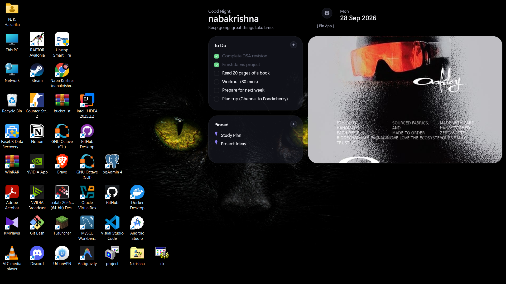
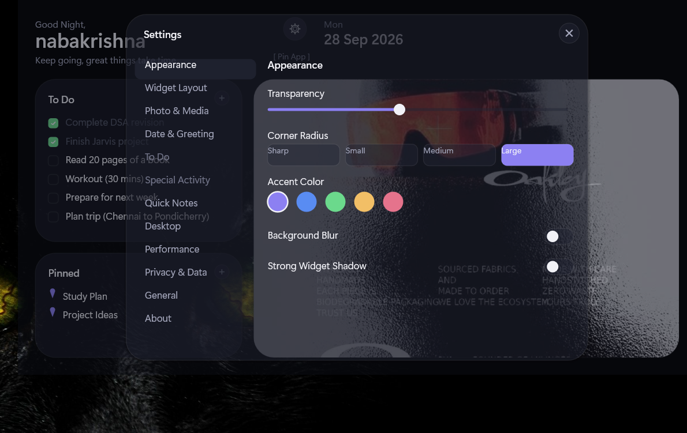

# Mosaic

A native Win32 + Direct2D + DirectComposition dashboard shell. No Electron,
no browser runtime, no third-party UI framework — just the Windows graphics
stack, driven directly.

## Features

- Desktop widgets for tasks, photos, activities, pinned items, and quick notes.
- Customizable appearance, widget layout, and greeting text.
- Local storage; Quick Notes are protected with Windows data protection.

## Why native C++

Mosaic uses C++20 with Win32, Direct2D, Direct3D 11, and DirectComposition to
integrate directly with the Windows desktop and graphics stack. This avoids
shipping an embedded browser runtime and gives the app control over rendering
and window behavior. The trade-off is that Mosaic is Windows-specific and
requires more platform-specific code than a cross-platform UI framework.

## Performance design

Mosaic redraws when the window is invalidated instead of running a continuous
render loop. Routine date, reminder, and photo checks share a once-per-minute
timer. A temporary timer runs at about 30 frames per second only during layout
or photo transitions, then stops; animations can also be disabled in Settings.
These design choices reduce unnecessary idle work, but performance varies by
device and should be measured before making speed or memory comparisons.

## Download

Download the packaged Windows build from the repository's **Releases** page,
extract it, and run `Mosaic.exe`. If no packaged release is available yet,
build the app from source using the steps below.

## Build from source

You need the following tools:

1. Visual Studio Build Tools (**Desktop development with C++**)
2. CMake 3.20 or newer
3. Ninja
4. VS Code extensions: **CMake Tools** (`ms-vscode.cmake-tools`) and **C/C++** (`ms-vscode.cpptools`), both from Microsoft

1. Clone the repository and open its folder in VS Code.
2. Press `Ctrl+Shift+P` → **CMake: Select a Kit** and choose an installed
   Visual Studio Release kit for **amd64**.
3. Run **CMake: Configure**, then **CMake: Build**.
4. The executable is created at `build/bin/Mosaic.exe`.

## Data and privacy

Mosaic stores its database at `%LOCALAPPDATA%\Mosaic\mosaic.db`. Photos are
read from the folder you select; Mosaic does not move or upload them. Quick
Notes use Windows data protection and are tied to your Windows account.

## Screenshots

## License

See [LICENSE](LICENSE).